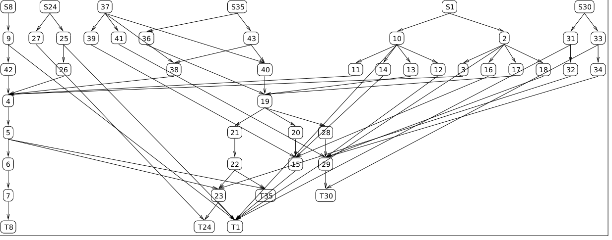

# DOT Graph Layout

This extension provides new graph types for McCLIM that perform layout by
integrating with other tools that speak
the [DOT language](https://www.graphviz.org/doc/info/lang.html). While the most
well known tools are these from the [Graphviz](https://www.graphviz.org/)
software suite, anything that speaks DOT should be usable.

This extension is MIT licensed.

## How it works

This extension integrates with the [cl-dot](https://github.com/michaelw/cl-dot)
project. When laying out the graph, an instance of `cl-dot::graph` is created
that represents the graph. This graph is then passed to a user overridable
function that must return a `cl-dot::graph` instance, with all the layout
relevant attributes (like `pos`) populated.

To use it, simply have Graphviz installed and specify the `:dot-digraph` graph
type.

## Other features

It is possible, but not trivial, to put labels on edges with
`format-graph-from-roots` (by specifying a custom `:arc-drawer`). Dot easily
supports labels and layout engines can include them when reasoning about the
layout. However, it is, in general, impossible to extract the label part from
an arc-drawer function to add it to the dot file.

Therefore, this extension provides the class `dot-arc-drawer`. This is a
funcallable class, so instances of it can be passed directly as the
`:arc-drawer` argument. This class creates a protocol for drawing edges and
drawing labels. In the most common case, you need only provide a function to
the `:edge-label-printer` initarg that accepts four required arguments (the
`dot-arc-drawer` instance, a stream, the from object, and the to object) and
any number of keyword arugments (the arguments to `:arc-drawing-options`). This
function should draw the label to the provided stream.

## Demo

Here is a graph layed out using McCLIM's default layout mechanisms:

Here is the same graph layed out using the `dot` tool from Graphviz:

## Known Issues

1. The input DOT graph has only the bounding box of each node. This means there
   may be a gap between arrows and the nodes to which they are connected.
